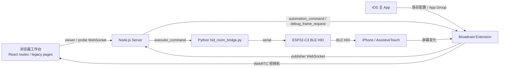

# 核心项目总览

本文档基于当前工作区两个核心仓库的实际代码整理：

- `IOS_stream_viewer`: iPhone 主 App + ReplayKit Broadcast Extension + Node.js 服务端 + 浏览器工作台
- `esp32_c3_gpt5.4`: ESP32-C3 BLE HID 固件 + Python 串口桥接工具 + 若干调试脚本

目标是回答四个问题：

1. 这套系统现在到底怎么分层。
2. 实时画面、OCR 调试、标定、自动化执行分别走哪条链路。
3. 每个仓库里哪些文件是真正的核心。
4. 当前代码里哪些模块是主路径，哪些更像保留实现或辅助工具。

## 1. 系统一句话说明

这是一套面向 iPhone 的远程自动化演示系统：

- iOS Broadcast Extension 负责采集屏幕并向浏览器推送 WebRTC 视频轨，同时按服务端指令执行 OCR / 图像检查。
- Node.js 服务端负责房间管理、WebSocket 信令、自动化状态机、标定状态机，以及自动化包管理。
- ESP32-C3 作为 BLE HID 设备连接 iPhone，模拟鼠标和键盘。
- Python bridge 作为 executor 接入服务端，把服务端下发的 `tap` / `drag` 翻译成串口命令，再由 ESP32 真正操作 iPhone。

当前主设计不是“把整条自动化流程放在手机端跑”，而是：

- 服务端编排步骤
- iOS 端负责观察屏幕并返回基础识别结果
- ESP32 端负责执行实际交互动作

这是一套典型的“观察与动作分离”的闭环结构。

## 2. 总体架构

## 3. 两个仓库的角色划分

### 3.1 IOS_stream_viewer

这个仓库是系统控制中心，内部又分成三层：

- `server/`: 真正的控制面，负责房间、状态机、自动化包、浏览器页面。
- `ios/App/`: 主 App，负责配置、诊断、方案下载、标定探针 UI。
- `ios/BroadcastUploadExtension/`: 真正执行屏幕采集、WebRTC 推流、远程检查、调试帧返回。

### 3.2 esp32_c3_gpt5.4

这个仓库是动作执行面，内部也分两层：

- `main/`: ESP32-C3 固件，作为 BLE HID 组合设备对 iPhone 暴露鼠标和键盘。
- `tools/hid_room_bridge.py`: Python executor bridge，把服务端动作翻译为串口命令。

此外还带了一层辅助调试工具：

- `tools/*.py` / `tools/*.sh`: 串口 CLI、自动测试、设备扫描。
- `node_controller/`: 早期的串口 Web 控制器，能发命令和看日志，但不是当前与 `IOS_stream_viewer` 集成的推荐闭环方案。

## 4. 核心链路

### 4.1 实时画面链路

目标：把 iPhone 屏幕实时显示到浏览器。

流程：

1. 主 App 把服务端地址、房间 ID、Token 保存到 App Group。
2. 用户通过系统屏幕录制启动 Broadcast Extension。
3. Extension 以 `publisher` 身份连接服务端 WebSocket。
4. 浏览器页面以 `viewer` 身份加入同一房间。
5. 服务端只做信令转发，Extension 为每个 viewer 创建 `RTCPeerConnection`。
6. Extension 将 ReplayKit 视频帧送入 `RTCVideoSource`，最终通过 WebRTC 视频轨传给浏览器。

关键点：

- 当前已经不是 README 里描述的 DataChannel JPEG 推流主路径，代码现状是 WebRTC 视频轨。
- 服务端 `/health` 里也把 `transport` 标成了 `webrtc-video-track`。

### 4.2 OCR 调试链路

目标：从 iOS 最近一帧内存图像里提取 OCR 结果，用于验证“观察链路”是否正常。

流程：

1. 浏览器 `debug-ocr.html` 通过 `probe` 或 `viewer` 通道发送 `debug_frame_request`。
2. 服务端记录请求人并把请求转发给 `publisher`。
3. Extension 用当前缓存的 `CVPixelBuffer` 调用 `RemoteAutomationInspector.makeDebugOCRPayload`。
4. Extension 回传 `debug_frame_result`，服务端再路由回原始请求方。
5. 页面绘制截图、OCR 框、命中结果和候选文本。

这个链路本质上是“服务端转发 + iOS 本地 OCR + 浏览器可视化”。

### 4.3 HID 标定链路

目标：把浏览器/服务端里的像素坐标转换为 ESP32 HID 实际可点击到的屏幕位置。

流程：

1. iOS 主 App 的 `SignalProbe` 以 `probe` 身份接入房间，并注册 `calibration_register role=app`。
2. 浏览器调试页发送 `calibration_start`。
3. 服务端创建 `calibrationSession`，按预设 `dx/dy + color` 采样步骤逐个下发。
4. 服务端先通知 iOS 标定 App `armTapCapture`，再向 executor 下发 `calibrationRawTap`。
5. Python bridge 把 raw HID move 变成串口命令，ESP32 通过 BLE HID 在 iPhone 上做真实点击。
6. iOS 标定界面接收点击并回传 `calibration_result`。
7. 服务端在彩色点击完成后再让 Extension 做一轮颜色点截图识别，计算 `kPixelsPerHidUnit`、`scaleX/scaleY/offsetX/offsetY` 等房间级标定参数。

这条链路的核心不是“点哪就记录哪”，而是：

- executor 负责执行原始 HID move
- 标定 App 负责采集实际点击
- Extension 负责截图识别彩色点
- 服务端负责拟合参数

### 4.4 自动化执行链路

目标：执行 `waitForText` / `waitForImage` / `tap` / `drag` 组成的自动化方案。

流程：

1. 浏览器工作台编辑步骤和图片模板，发布到服务端。
2. 服务端把 ZIP 保存到 `server/data/automation`，维护 package metadata。
3. 浏览器选择某个 package/revision，发送 `automation_start`。
4. 服务端加载 `automation.json` 和图片模板，创建 `automationSession`。
5. 对等待类步骤：
   - 服务端向 Extension 下发 `startCheckItem` / `checkNextItem`
   - Extension 用 `RemoteAutomationInspector` 做 OCR 或模板匹配
   - 服务端根据返回 payload 判断是否命中、是否超时、是否保存变量
6. 对动作类步骤：
   - 服务端用当前房间 calibration 修正坐标
   - 服务端向 executor 下发 `tap` / `drag`
   - Python bridge 翻译为串口命令
   - ESP32 通过 BLE HID 真正执行
   - 服务端只有拿到 `executor_result=ok` 才进入下一步

因此当前自动化实现的主导者是服务端，而不是 iOS 本地 runner。

## 5. IOS_stream_viewer 仓库详解

### 5.1 服务端层

#### 入口文件

- `server/index.js`
  - 初始化 Express、HTTP Server、`ws` WebSocket Server。
  - 注册路由和 WebSocket 处理器。

#### HTTP 路由

- `server/routes.js`
  - `/health`: 查看房间状态、publisher/executor/calibration app 是否在线。
  - `/api/automation/packages`: 自动化包列表与上传。
  - `/api/automation/packages/:packageId`: 读取 metadata。
  - `/api/automation/packages/:packageId/active`: 设置 active revision。
  - `/api/automation/packages/:packageId/download`: 下载 ZIP。

#### WebSocket 控制面

- `server/websocket.js`
  - 定义四种客户端角色：`publisher`、`viewer`、`probe`、`executor`。
  - 为不同角色建立房间状态、替换旧连接、权限校验和消息分发。
  - 处理的核心消息有：
    - `signal`
    - `debug_frame_request` / `debug_frame_result`
    - `calibration_register` / `calibration_start` / `calibration_result`
    - `automation_start` / `automation_stop`
    - `automation_result`
    - `executor_result`

#### 运行时状态机

- `server/runtime.js`
  - 这是当前仓库最关键的文件。
  - 内部维护三类核心状态：
    - `rooms`
    - `automationSessions`
    - `calibrationSessions`
  - 还维护 `debugFrameRequests`，用于把调试帧结果回送给最初请求者。

`runtime.js` 的职责可以拆成五部分：

1. 房间模型
   - publisher、executor、viewer、probe 的注册、广播、断开处理。
2. 调试帧转发
   - `handleDebugFrameResult`。
3. 标定状态机
   - `startCalibrationSession`
   - `handleCalibrationResult`
   - `handleCalibrationColorFrameResult`
   - `finalizeCalibrationSession`
4. 自动化状态机
   - `startAutomationSession`
   - `executeAutomationStep`
   - `handleAutomationResult`
   - `handleExecutorResult`
   - `finalizeAutomationSession`
5. 自动化包存储
   - 保存 ZIP、读取 metadata、装载 revision、暴露下载路径。

#### 浏览器页面

- `frontend/src/`
  - 当前 React 前端源码。
  - 包含工作台路由、OCR 调试路由、viewer/probe hooks 与 API 封装。

- `server/public/index.html`
  - 这是 legacy 综合工作台。
  - 功能包括：实时视频查看、裁剪模板、编辑 automation JSON、发布 ZIP、选择 revision、启动/停止自动化、显示动作事件与结果。

- `server/public/debug-ocr.html`
  - 这是 legacy OCR/标定调试页。
  - 功能包括：连接 probe 通道、请求内存帧 OCR、显示 OCR 候选框、发起 3 点以上的标定流程、显示彩色点参考图。

### 5.2 iOS 主 App 层

#### 工程描述

- `ios/project.yml`
  - XcodeGen 配置。
  - 定义 App 和 Broadcast Extension 两个 target。
  - 通过 App Group 共享配置和诊断数据。

#### 配置与共享状态

- `ios/App/Sources/StreamConfiguration.swift`
  - 定义 App Group、服务端配置、最新回放截图路径、诊断字段键名、active package 键名。
  - 主 App 和 Extension 通过这里约定共享存储格式。

#### 主界面

- `ios/App/Sources/ContentView.swift`
  - 当前主 App 的职责很多，基本是运维控制台：
    - 保存服务端地址、房间 ID、Token
    - 测试服务端连通性和本地网络权限
    - 建立主动 `probe` 连接
    - 下载自动化包并设为 active
    - 展示 Extension 诊断
    - 对最近 replay 截图做本地 OCR 调试
    - 提供 HID 标定触控面
    - 打开系统 Broadcast Picker

#### 自动化包下载器

- `ios/App/Sources/AutomationPackageManager.swift`
  - 通过 HTTP 读取服务端 automation metadata。
  - 下载 ZIP 到 App Group。
  - 解压后把 active package 路径写入共享存储。

#### 主 App 标定探针

- `ios/App/Sources/SignalProbe.swift`
  - 通过 `probe` WebSocket 连接服务端。
  - 自动注册 `calibration app` 角色。
  - 响应 `calibration_command`。
  - 把用户触摸到的本地像素点击位置回传给服务端。

#### 本地 OCR 检查器

- `ios/App/Sources/ReplayFrameOCRInspector.swift`
  - 读取 Extension 最近写入 App Group 的截图文件。
  - 使用 Vision OCR 做本地调试识别。
  - 返回命中框和标注图片。

### 5.3 Broadcast Extension 层

#### 主入口

- `ios/BroadcastUploadExtension/Sources/SampleHandler.swift`
  - 这是 iOS 端最核心的实现文件。
  - 实际承担的职责有：
    - 读取共享配置
    - 以 `publisher` 身份连接服务端
    - 管理多个 viewer 的 `RTCPeerConnection`
    - 将 ReplayKit 视频帧送入 WebRTC 视频轨
    - 缓存最新 `CVPixelBuffer`
    - 按需持久化最近一帧截图到 App Group
    - 响应服务端下发的 automation/debug/calibration 相关命令

#### 远程检查器

- `ios/BroadcastUploadExtension/Sources/RemoteAutomationInspector.swift`
  - 当前自动化等待类步骤的实际执行器。
  - 支持：
    - `waitForText`: Vision OCR
    - `waitForImage`: 灰度模板匹配
    - `debug frame OCR`: 返回 OCR 候选和匹配项
  - 它不推进整个自动化流程，只返回基础检查数据。

#### 本地自动化 Runner

- `ios/BroadcastUploadExtension/Sources/AutomationRunner.swift`
  - 这是一个更早期、更偏“端侧自主执行”的实现。
  - 它可以本地读取 active package，然后在设备上顺序推进步骤。
  - 但结合 `SampleHandler.swift` 的当前逻辑来看，主路径已经切到了远程编排模式，`AutomationRunner` 更像保留实现或备用代码，而不是当前执行主链路。

#### 共享配置镜像

- `ios/BroadcastUploadExtension/Sources/SharedStreamConfiguration.swift`
  - 复制了 App 侧共享键定义，保证 Extension 能读取相同配置与状态位。

## 6. esp32_c3_gpt5.4 仓库详解

### 6.1 固件层

#### 项目入口

- `CMakeLists.txt`
  - 标准 ESP-IDF CMake 入口。

#### HID 组合设备实现

- `main/main.c`
  - 这个文件承担了固件主逻辑：
    - 定义鼠标 + 键盘 combo HID report map
    - 管理连接状态和按钮状态
    - 通过 USB Serial/JTAG 接收串口命令
    - 把命令翻译为 HID 报文
  - 当前支持的结构化命令包括：
    - `move <dx> <dy>`
    - `press`
    - `release`
    - `click`
    - `drag <dx> <dy>`
    - `home [count]`
    - `type <text>`
    - `key <name>`
    - `status`

这里最重要的设计点是：

- 对外暴露的是相对移动 HID，而不是绝对屏幕坐标。
- 所以服务端必须做标定，bridge 也必须知道目标屏幕尺寸和偏移量。

#### BLE GAP 与配对

- `main/esp_hid_gap.c`
  - 负责 BLE 广播、安全配对、bonding、静态随机地址和连接事件处理。
  - 当前启用了 authenticated pairing，并在日志里输出配对与加密状态。

### 6.2 Python executor bridge

- `tools/hid_room_bridge.py`
  - 这是和 `IOS_stream_viewer` 当前闭环方案真正对接的关键脚本。
  - 它做了三件事：
    1. 通过 WebSocket 以 `executor` 身份接入 room
    2. 通过串口独占打开 ESP32 设备
    3. 把服务端动作转换成 ESP32 串口命令并等待 `bridge_ack`

桥接脚本当前支持三类动作：

- `tap`
- `drag`
- `calibrationRawTap`

它内部的关键类：

- `SerialCommandClient`
  - 独占管理串口、后台读日志、等待 `bridge_ack` / `bridge_nack`。
- `HIDActionExecutor`
  - 把像素点位换算成 raw HID / 设备坐标。
  - 把拖拽拆成多段 `move`，并控制 `press` / `release` 时序。

### 6.3 辅助脚本层

- `tools/hid_mouse_cli.py` / `tools/hid_mouse_cli.sh`
  - 手动发串口命令。

- `tools/test_hid_mouse.py` / `tools/test_hid_mouse.sh`
  - 联合测试 BLE 连接和串口日志。

- `tools/scan_dev_path.py` / `tools/scan_dev_path.sh`
  - 在 macOS 上扫描硬件并映射到 `/dev/cu.*`。

### 6.4 node_controller 的定位

- `node_controller/server.js`
  - 提供 HTTP + WebSocket 的串口控制页面。
  - 本质上是一个本地串口控制服务。
  - 它能用于人工调试，但没有接入 `IOS_stream_viewer` 的 executor 协议。

结论：

- `node_controller/` 不是当前核心闭环的一部分。
- 当前推荐路径是 `IOS_stream_viewer server` + `tools/hid_room_bridge.py`。

## 7. 当前主路径与保留实现判断

这是阅读代码后最需要强调的结论。

### 当前主路径

1. 视频传输主路径是 WebRTC 视频轨，不是旧式 DataChannel JPEG。
2. 自动化执行主路径是服务端编排，不是 iOS 本地串行 runner。
3. 动作执行主路径是 executor bridge + ESP32 BLE HID，不是浏览器直接控制串口。
4. 标定主路径是服务端状态机 + probe App 点击回传 + Broadcast 颜色识别联合计算。

### 保留实现或辅助实现

1. `AutomationRunner.swift` 更像旧方案或备用实现，目前不是主路径。
2. `node_controller/` 是串口调试工具，不是当前推荐集成方式。
3. 主 App 里的“下载 active package 本地执行”文案有历史痕迹，和现在服务端远程编排模式并不完全一致。

## 8. 关键状态与数据存储

### 服务端内存态

- `rooms`
- `automationSessions`
- `calibrationSessions`
- `debugFrameRequests`

这些状态都在 `server/runtime.js` 中维护，属于进程内内存态，不是持久化数据库。

### 服务端磁盘态

- `server/data/automation/`
  - 保存 automation package 的 metadata、revision 和 ZIP。

### iOS App Group 共享态

- 服务端地址 / roomID / token
- Extension 诊断信息
- active package 信息
- 最近 replay 截图

这些由 `StreamConfiguration.swift` 和 `SharedStreamConfiguration.swift` 约定。

## 9. 启动顺序建议

如果从零开始跑通整套系统，建议按这个顺序：

1. 启动 `IOS_stream_viewer` 的 Node.js 服务端。
2. 烧录并配对 ESP32-C3，使 iPhone 能看到鼠标指针。
3. 启动 `tools/hid_room_bridge.py`，让 executor 进入目标 room。
4. 在 iOS 主 App 中保存服务端地址和 room。
5. 在浏览器打开工作台页面，确认 viewer 已进入 room。
6. 用主 App 的 `SignalProbe` 连接标定通道。
7. 如需点击/拖拽，先完成标定。
8. 最后启动系统屏幕广播，让 Broadcast Extension 成为 publisher。
9. 再做 OCR 调试或自动化执行。

## 10. 接手开发时优先关注的文件

如果后续要继续开发，建议优先读以下文件：

### 第一优先级

- `server/runtime.js`
- `server/websocket.js`
- `ios/BroadcastUploadExtension/Sources/SampleHandler.swift`
- `ios/BroadcastUploadExtension/Sources/RemoteAutomationInspector.swift`
- `tools/hid_room_bridge.py`
- `main/main.c`

### 第二优先级

- `frontend/src/routes/WorkbenchPage.jsx`
- `frontend/src/routes/DebugOcrPage.jsx`
- `server/public/index.html`
- `server/public/debug-ocr.html`
- `ios/App/Sources/ContentView.swift`
- `ios/App/Sources/SignalProbe.swift`
- `ios/App/Sources/AutomationPackageManager.swift`
- `main/esp_hid_gap.c`

### 第三优先级

- `ios/BroadcastUploadExtension/Sources/AutomationRunner.swift`
- `node_controller/server.js`

## 11. 总结

当前这套代码已经不是简单的“iOS 推屏 demo”，而是一个完整的远程自动化原型系统：

- `IOS_stream_viewer` 负责观察、编排、可视化和调试。
- `esp32_c3_gpt5.4` 负责真实 HID 动作执行。
- 服务端是系统中枢。
- Broadcast Extension 是观察执行器。
- Python bridge + ESP32 是动作执行器。

如果后续继续扩展，这套系统最重要的边界不要打乱：

- 服务端负责编排和状态收敛
- iOS 端负责观察和基础识别
- ESP32 端负责真实动作

只要这三个边界保持清晰，后续无论是换掉 WebRTC 实现、升级 OCR、增加更多动作类型，还是替换执行硬件，系统都还能稳定演进。